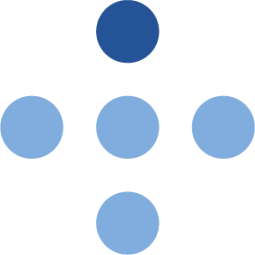

# imongr 

<!-- badges: start -->
[](https://github.com/mong/imongr/releases)
[](https://github.com/mong/imongr/actions)
[](https://app.codecov.io/gh/mong/imongr/tree/main/R)
[](https://github.com/mong/imongr/issues)
[](https://www.gnu.org/licenses/gpl-3.0)
[](https://mong.github.io/imongr/)
<!-- badges: end -->

Primarily a tool to update data used by the [mongts](https://github.com/mong/mongts/) application.

## Install

You can install the released version of imongr from [GitHub](https://github.com/mong/imongr) with:

``` r
remotes::install_github("mong/imongr")
```

## Development

The easiest way to develop `imongr` is to fire up the `docker-compose.yml` file:

```sh
docker-compose up
```

This file consist of seven different services:
- three mariadb databases (`prod` at port `3331`, `verify` at port `3332`, and `qa` at port `3333`)
- Adminer, a tool for database management, at port [8888](http://localhost:8888/)
- RStudio at port [8787](http://localhost:8787/)
- Code-server (vscode) at port [8080](http://localhost:8080/)
- The app, based on the `hnskde/imongr:latest` image, at port [3838](http://localhost:3838/)

Open [localhost:8787](http://localhost:8787/) with your favorite browser and login with `rstudio` and `password`. Go into the `imongr` folder, open `imongr.Rproj`, and press **Yes** to *Do you want to open the project ~/imongr?*. Start coding. If you prefer *vscode*, you can open [localhost:8080](http://localhost:8080/) instead.

Populate the databases by using Adminer, either through `imongr` (*Administrative verktøy* - *Adminer*) or through [port 8888](http://localhost:8888/) (the password is the same as username/db/repository name).

The data can be visualized by using the `mongts` app:

```bash
export DB_PORT=3331 # or 3332 for the verify database
yarn install && yarn dev # inside the mongts folder
```

The data can then be seen at [localhost:3000/kvalitetsregistre/alle/sykehus/](http://localhost:3000/kvalitetsregistre/alle/sykehus/)

### Build docker image and run the container app locally

```bash
R CMD build .
docker build -t hnskde/imongr:latest .
docker compose up
```

Navigate a browser to [localhost:3838/](http://localhost:3838/).

### Getting out of some dirty states

If the environment variables have been changed an you want to change them back to default:

```r
readRenviron("~/.Renviron")
```

If your pool have not been closed properly, for instance if you have not cleaned up after testing with database:

1. Go into Adminer on port [8888](http://localhost:8888/?server=db&username=imongr), and click on `db` in the breadcrumb.
2. Click *Refresh* next to *Database* in the database table and delete all unwanted databases.
3. Look at *Process list* and kill unwanted processes.
4. Go into *RStudio* on port [8787](http://localhost:8787/) and restart `R` (Ctrl-Shift-F10). 

## Ethics
Please note that the 'imongr' project is released with a [Contributor Code of Conduct](CODE_OF_CONDUCT.md). By contributing to this project, you agree to abide by its terms.
